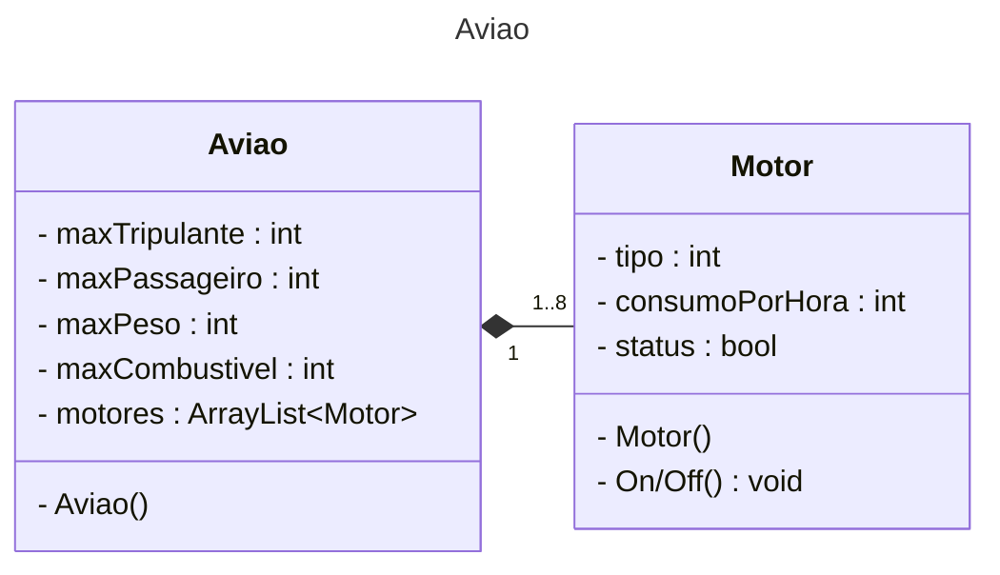

```mermaid
---
title: Aviao
---
classDiagram

    direction LR

    Aviao "1" *--  "1..8" Motor

    class Aviao{
        - maxTripulante : int
        - maxPassageiro : int
        - maxPeso : int
        - maxCombustivel : int
        - motores : ArrayList~Motor~
        - Aviao()
    }

    class Motor{
        - tipo : int
        - consumoPorHora : int
        - status : bool
        - Motor()
        - On/Off() void
    }
```