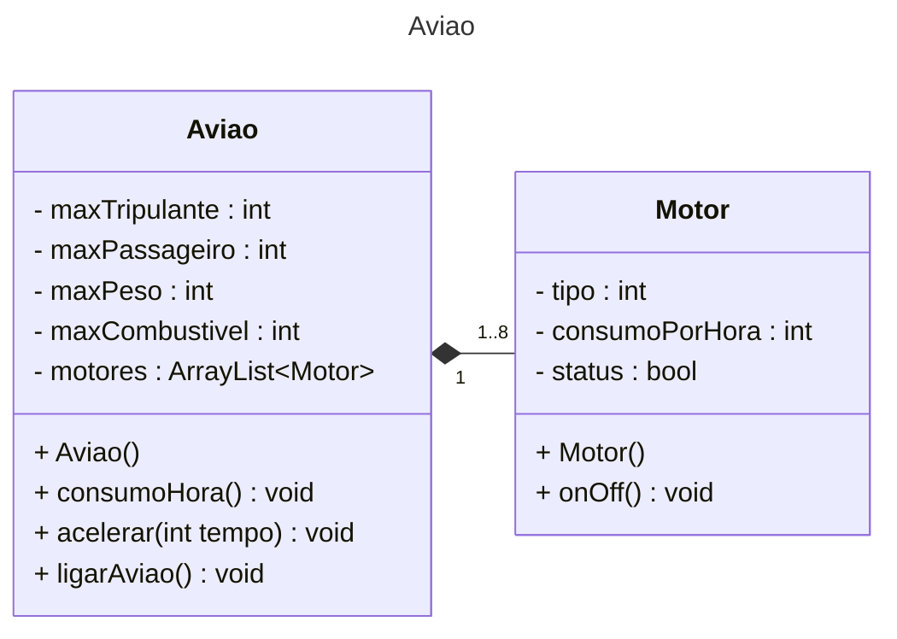

```mermaid
---
title: Aviao
---
classDiagram

    direction LR

    Aviao "1" *--  "1..8" Motor

    class Aviao{
        - maxTripulante : int
        - maxPassageiro : int
        - maxPeso : int
        - maxCombustivel : int
        - motores : ArrayList~Motor~
        + Aviao()
        + consumoHora() void
        + acelerar(int tempo) void
        + ligarAviao() void
    }

    class Motor{
        - tipo : int
        - consumoPorHora : int
        - status : bool
        + Motor()
        + onOff() void
    }
```