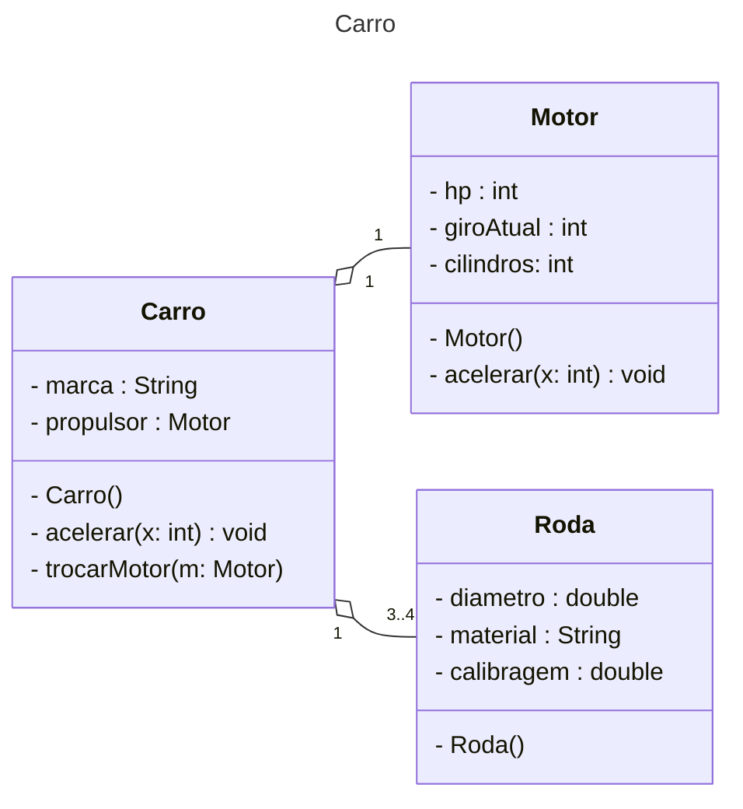

```mermaid
---
title: Carro
---

classDiagram

    direction LR

    Carro "1" o--  "1" Motor
    Carro "1" o-- "3..4" Roda

    class Carro{
        - marca : String
        - propulsor : Motor
        - Carro()
        - acelerar(x: int) void
        - trocarMotor(m: Motor)
    }

    class Motor{
        - hp : int
        - giroAtual : int
        - cilindros: int
        - Motor()
        - acelerar(x: int) void
    }

    class Roda{
        - diametro : double
        - material : String
        - calibragem : double
        - Roda()
    }
```