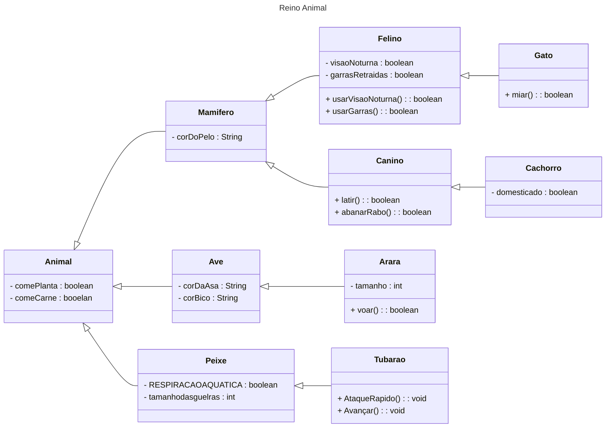

```mermaid
---
title: Reino Animal
---
classDiagram

    direction LR

    Animal <|-- Mamifero
    Animal <|-- Ave
    Animal <|-- Peixe

    class Animal{
        - comePlanta : boolean
        - comeCarne : booelan
    }

    class Felino{
        - visaoNoturna : boolean
        - garrasRetraidas : boolean
        + usarVisaoNoturna() : boolean
        + usarGarras() : boolean
    }

    class Mamifero{
        - corDoPelo : String
    }
    
    Mamifero <|-- Felino
    

    class Gato{
        + miar() : boolean
    }

    Felino <|-- Gato

    class Canino{
        + latir() : boolean
        + abanarRabo() : boolean
    }

    Mamifero <|-- Canino 

    class Cachorro{
        - domesticado : boolean
    }

    Canino <|-- Cachorro

    class Ave{
        - corDaAsa : String
        - corBico : String
    }


    class Arara{
        - tamanho : int
        + voar() : boolean
    }

    Ave <|-- Arara

    class Peixe{
        - RESPIRACAOAQUATICA : boolean
        - tamanhodasguelras : int
    }

    Peixe <|-- Tubarao

    class Tubarao{
        + AtaqueRapido() : void
        + Avançar() : void
    }
```