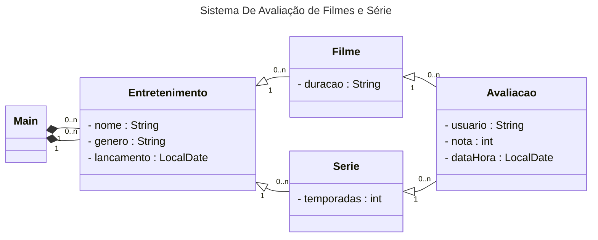

```mermaid
---
title: Sistema De Avaliação de Filmes e Série
---
classDiagram

    direction LR

    Entretenimento "1" <|-- "0..n" Serie
    Entretenimento "1" <|-- "0..n" Filme
    Main "1" *-- "0..n" Entretenimento
    Main "1" *-- "0..n" Entretenimento

    Filme "1" <|-- "0..n" Avaliacao
    Serie "1" <|-- "0..n" Avaliacao
    

    class Main{

    }

    class Entretenimento{
        - nome : String
        - genero : String
        - lancamento : LocalDate
    }

    class Filme{
        - duracao : String
    }

    class Serie{
        - temporadas : int
    }

    class Avaliacao{
        - usuario : String
        - nota : int
        - dataHora : LocalDate
    }
```