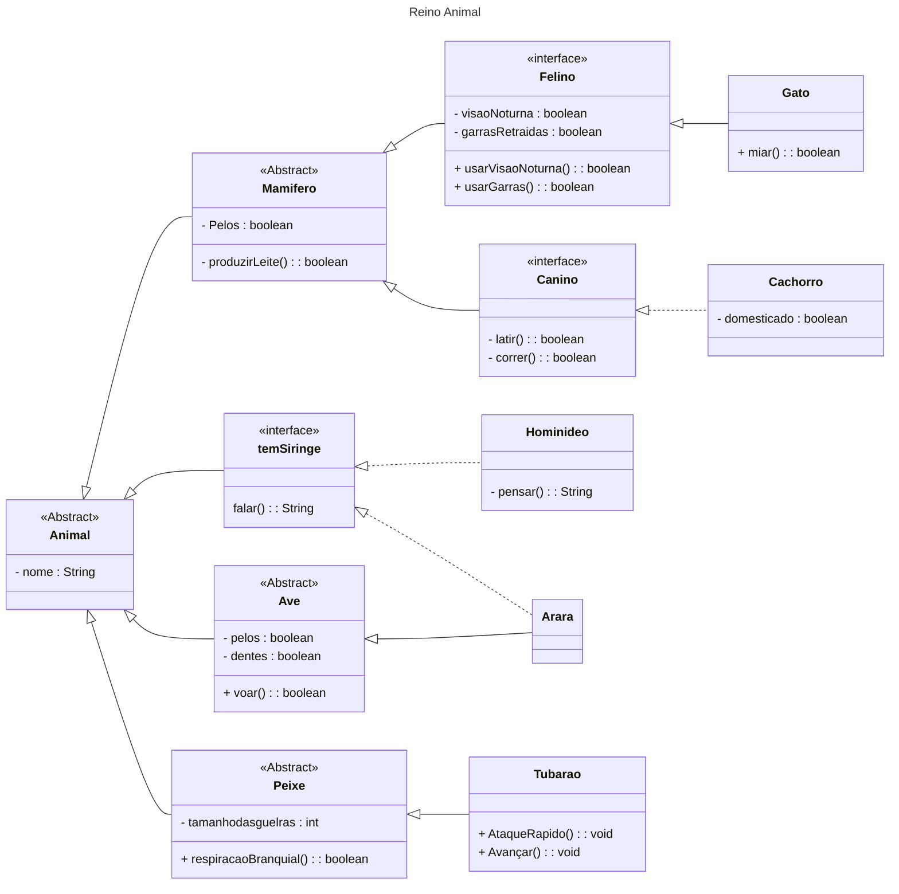

```mermaid
---
title: Reino Animal
---
classDiagram

    direction LR

    Animal <|-- Mamifero
    Animal <|-- Ave
    Animal <|-- Peixe

    class Animal{
        - nome : String
    }

    
    class Felino {
        - visaoNoturna : boolean
        - garrasRetraidas : boolean
        + usarVisaoNoturna() : boolean
        + usarGarras() : boolean
    }

    class Mamifero{
        - produzirLeite() : boolean
        - Pelos : boolean
    }
    
    <<Abstract>> Mamifero
    <<Abstract>> Animal
    <<Abstract>> Ave
    <<interface>> Felino
    <<Abstract>> Peixe
    Mamifero <|-- Felino
    

    class Gato{
        + miar() : boolean
    }

    Felino <|-- Gato

    class Canino{
        - latir() : boolean
        - correr() : boolean
    }

    <<interface>> Canino

    Mamifero <|-- Canino 

    class Cachorro{
        - domesticado : boolean
    }

    Canino <|.. Cachorro

    class Ave{
        - pelos : boolean
        - dentes : boolean
        + voar() : boolean
    }

    class Hominideo{
        - pensar() : String
    }

    temSiringe <|.. Hominideo
    Animal <|-- temSiringe

    class temSiringe{
        falar() : String
    }

    <<interface>> temSiringe

    temSiringe <|.. Arara

    class Arara{
        
    }

    Ave <|-- Arara

    class Peixe{
        + respiracaoBranquial() : boolean 
        - tamanhodasguelras : int
    }

    Peixe <|-- Tubarao

    class Tubarao{
        + AtaqueRapido() : void
        + Avançar() : void
    }
```