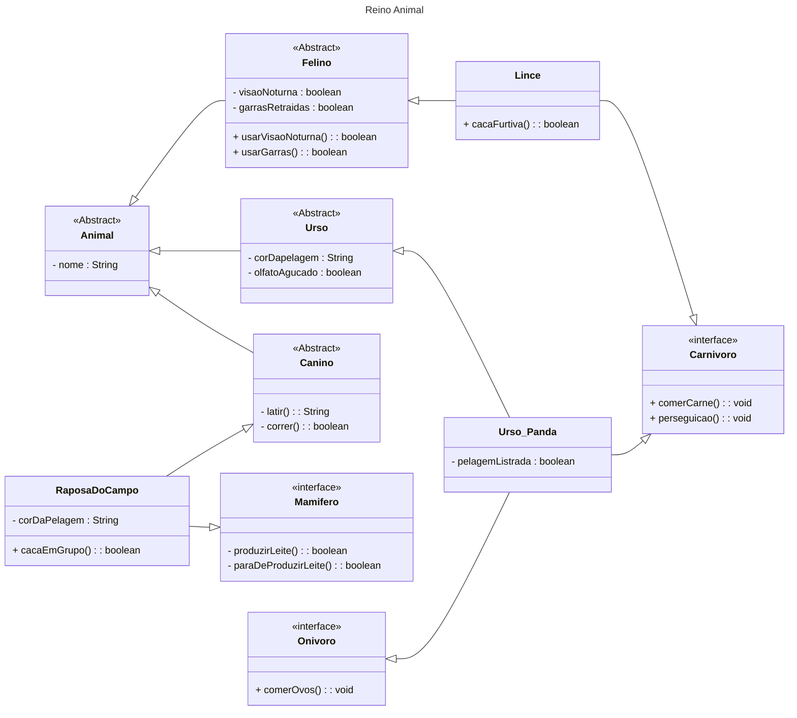

```mermaid
---
title: Reino Animal
---
classDiagram

    direction LR

    class Animal{
        <<Abstract>>
        - nome : String
    }

    Animal <|-- Urso
    Animal <|-- Felino
    Animal <|-- Canino

    class Urso {
        <<Abstract>>
        - corDapelagem : String
        - olfatoAgucado : boolean
    }

    Urso <|-- Urso_Panda
    
    class Felino {
        <<Abstract>>
        - visaoNoturna : boolean
        - garrasRetraidas : boolean
        + usarVisaoNoturna() : boolean
        + usarGarras() : boolean
    }

    Felino <|-- Lince

    class Mamifero{
        <<interface>>
        - produzirLeite() : boolean
        - paraDeProduzirLeite() : boolean
    }

    class Carnivoro{
        <<interface>>
        + comerCarne() : void
        + perseguicao() : void
    }

    Lince --|> Carnivoro

    class Onivoro{
        <<interface>>
        + comerOvos() : void
    }
    
    Onivoro <|-- Urso_Panda

    class Urso_Panda{
        - pelagemListrada : boolean
    }

    Urso_Panda --|> Carnivoro

    class Lince{
        + cacaFurtiva() : boolean
    }

    class Canino{
        <<Abstract>>
        - latir() : String
        - correr() : boolean
    }
    
    class RaposaDoCampo{
        - corDaPelagem : String
        + cacaEmGrupo() : boolean
    }

    RaposaDoCampo --|> Canino
    RaposaDoCampo --|> Mamifero

```